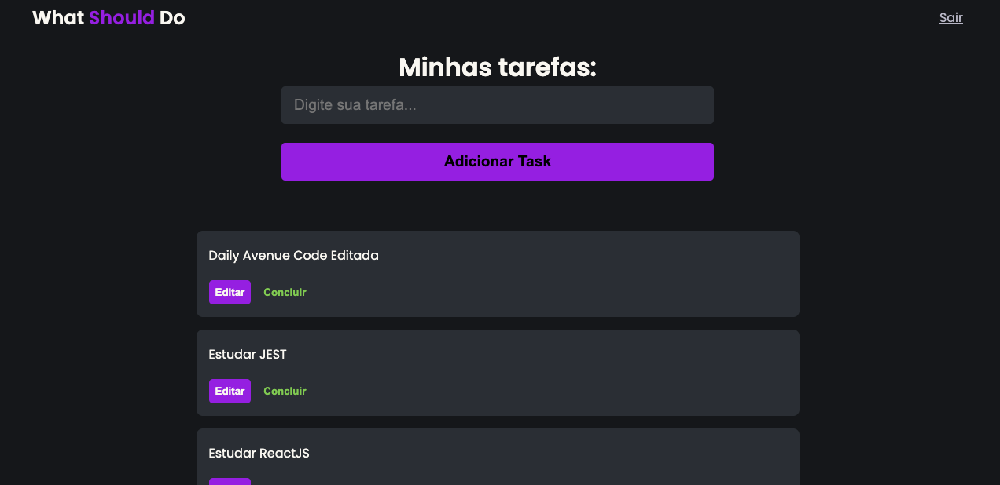
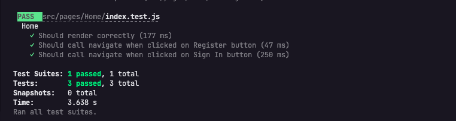

<h1 align="center">What Should Do</h1>
<p align="center">Projeto criado para a finalização do módulo de Aprendizado de ReactJS no curso desenvolvido pela Avenue Code de Front End. <br>
O projeto baseia-se numa lista de tarefas, onde o usuário poderá: criar sua lista, editar, salvar ou excluir as tarefas. Pela integração com o Firebase, o projeto proporciona ao usuário utilizar diversas contas para login na aplicação.
</p>
<p><b>Para os testes, um user default foi criado, porém a criação de um usuário próprio poderá ser feita normalmente. Use os seguintes dados para acessar o usuário teste:</b></p>

```bash

email: teste@teste.com
senha: 123123

```

<h2 align="center">
    
</h2>
<hr/>

## Tecnologias

As seguintes ferramentas foram usadas na construção do projeto:

- [React](https://pt-br.reactjs.org/)
- [Firebase](https://firebase.google.com/docs?hl=pt)
- [Jest](https://jestjs.io/)

## Pré-requisitos

Antes de começar, você vai precisar ter instalado em sua máquina as seguintes ferramentas:
[Git](https://git-scm.com), [Node.js](https://nodejs.org/en/).
Além disto é bom ter um editor para trabalhar com o código como [VSCode](https://code.visualstudio.com/)

## Como instalar

``` bash
1. Clone o repositório:

`git clone https://gitlab.com/acbr/academy/student-assignments/marcos-silva-react-assignment`

ou faça o download do código-fonte em formato ZIP.

2. Acesse a pasta do projeto:
   `cd marcos-silva-react-assignment`

3. Instale as dependências:
   `npm install`

4. Inicie o servidor de desenvolvimento:
   `npm start`

O projeto estará disponível no endereço `http://localhost:3000`.


```

## Como executar os testes

1. Execute o comando:
``` bash
npm test
```


<p>Em caso de todos os testes passarem, a mensagem que aparecerá deverá ser como esta:</p>
<h2 align="center">
    
</h2>

## Licença

MIT.

### Autor

<div align="right">
   <h4>Feito por Marcos Silva 👋🏽 Entre em contato!</h4>
    <p><b>Projeto de finalização do AC Academy - FrontEnd</b></p>
    <p>Desenvolvido por Marcos Guilherme Silva</p>
    <p>Monitoria de Rodrigo Rodrigo Schamber</p>
    <p>Entre em contato!</p>
  <a href="mailto:marcosguiherme.silva@outlook.com"> E-mail </a> |
  <a href="https://www.linkedin.com/in/marcos-guilherme-barbosa-da-silva-8313121a4/">LinkedIn</a>
  </div>
</ul>